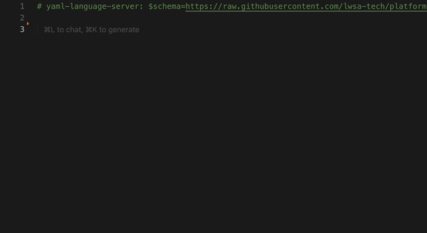

- [Setup](#setup)
  - [Deploy Key](#deploy-key)
    - [GitHub ou Gitea](#github-ou-gitea)
    - [Azure DevOps](#azure-devops)
    - [GitLab](#gitlab)
  - [Instalar ferramentas](#instalar-ferramentas)
    - [Devbox](#devbox)
  - [Kubeconfig](#kubeconfig)
  - [Grafana](#grafana)
  - [Argo CD](#argo-cd)
    - [Webhook](#webhook)
- [Operação](#operação)
  - [Blueprints](#blueprints)
    - [Funcionamento da chave `port`](#funcionamento-da-chave-port)
    - [Diferença entre `expose` e `ingress`](#diferença-entre-expose-e-ingress)
    - [Tráfego de saída](#tráfego-de-saída)
    - [Catálogo de planos](#catálogo-de-planos)
    - [Recomendações para produção](#recomendações-para-produção)
    - [Variáveis de ambiente `dbServers`, `searches` e `messageBrokers`](#variáveis-de-ambiente-dbservers-searches-e-messagebrokers)
      - [`pxc` e `cnpg`](#pxc-e-cnpg)
      - [`dragonfly`](#dragonfly)
      - [`ferretdb` e `psmdb`](#ferretdb-e-psmdb)
      - [`elasticsearch`](#elasticsearch)
      - [`rabbitmq`](#rabbitmq)
    - [OpenTelemetry](#opentelemetry)
    - [Prune resources](#prune-resources)
    - [Segredos via kubeseal](#segredos-via-kubeseal)
      - [Charts](#charts)
  - [Criar novo chart](#criar-novo-chart)
    - [Values embutidos](#values-embutidos)
  - [Slack](#slack)
  - [Horários de backups e reboots](#horários-de-backups-e-reboots)

## Setup

### Deploy Key
No repositório que você criou para _blueprints_ e _charts_, adicione o _deploy key_ informado da seguinte forma:
#### GitHub ou Gitea
- Clique em _Settings_, _Deploy keys_, _Add deploy key_
- Em _Title_ e _Key_ coloque os dados recebidos
- Manter desativado _Allow write access_ e adicionar.

#### Azure DevOps
- Clique no ícone _User settings_, _SSH public keys_
- Em _Description_ e _Key data_ coloque os dados recebidos

#### GitLab
- Acesse _Settings_, _Repository_
- Em _Deploy keys_, selecione _Add new key_
- Complete os campos, mantendo desativado _Grant write permissions..._

### Instalar ferramentas
- [kubectl](https://kubernetes.io/docs/tasks/tools/#kubectl)
- [Kubelogin](https://github.com/int128/kubelogin?tab=readme-ov-file#setup)
- [K9s](https://k9scli.io/)
- [Kubeseal](https://github.com/bitnami-labs/sealed-secrets?tab=readme-ov-file#kubeseal) 

#### Devbox
Alternativamente, o _Devbox_ permite uma instalação rápida de todas as ferramentas sem intereferir no funcionamento dos demais programas do seu computador. Funciona em _Windows (WSL)_, _Mac OS_ e _Linux_.

- Instalar Devbox
```bash
curl -fsSL https://get.jetify.com/devbox | bash
```
- Copie [devbox.json](devbox.json) para a raiz do seu repo GitOps.
- Para iniciar uma sessão, mude para o diretório do repositório, onde se encontra o arquivo _devbox.json_, e carregar o ambiente com:
```bash
devbox shell
```
- Para finalizar a sessão digite `exit`.

### Kubeconfig

Para usar o arquivo _kubeconfig_ recebido, copie-o para o diretório de sua escolha e exporte a variável de ambiente:
```bash
export KUBECONFIG=<caminho para o kubeconfig>
```
Caso você gerencie vários clusters, você pode configurar `KUBECONFIG` na forma:
```bash
export KUBECONFIG=/Users/gmautner/eks-04-n7n5uagr:/Users/gmautner/eks-05-9tesxlff:/Users/gmautner/hetzner-03-n71u1dz8:/Users/gmautner/cs-06-ux9w1ae2:/Users/gmautner/eks-06-8mrd1nnn:/Users/gmautner/cs-08-5gztbqei
```
E alternar entre os clusters via `kubectl config use-context <nome do cluster>` ou `:ctx` no _k9s_.

### Grafana

Use a _URL_ fornecida para acessar o _Grafana_.

_Dashboards_ recomendados:
- _Kubernetes / Compute Resources / Cluster_: para monitorar capacidade agregada do _cluster_
- _Kubernetes / Compute Resources / Namespaces (Workloads)_: para monitorar uso agregado por _namespace_
- _monitoring_ / _Trivy Operator Dashboard_: para monitorar _CVEs_

### Argo CD

Use a _URL_ fornecida para acessar o _Argo CD_.

#### Webhook
O _Argo CD_ sincroniza automaticamente _charts_ e _blueprints_ a cada 3 minutos, ou manualmente via botão _Refresh_ dentro de cada _Application_.

Opcionalmente, você pode configurar um _webhook_ de forma que, a cada _push_ no repositório, é disparada uma sincronização. Para isto, crie o _webhook_ informado, lembrando de alterar _Content type_ para `application/json`.

Mais informações: https://argo-cd.readthedocs.io/en/stable/operator-manual/webhook/

## Operação

### Blueprints

0) Accesse a página do _Cockpit_ do projeto, por exemplo https://poc.object-storage.sh:9000/playground-public/cockpit.html e escolha o ambiente desejado, por exemplo `dev`
1) Clone o repositório _GitOps_ conforme instruções na página e abra-o no _VS Code_ ou _Cursor_
2) Instale a extensão __YAML Language Support by Red Hat__ para melhorar a experiência de edição.
3) Mude para o diretório indicado no _Cockpit_ para o ambiente desejado, exemplo `dev/blueprints`
4) Crie uma nova pasta sob este diretório, por exemplo `dev/blueprints/meu-aplicativo`. Um _namespace_ correspondente será criado no _cluster_ com o mesmo nome (exemplo `meu-aplicativo`)
5) Crie um arquivo `blueprint.yaml` sob esta pasta, por exemplo `dev/blueprints/meu-aplicativo/blueprint.yaml`.
6) Na primeira linha do arquivo `blueprint.yaml` coloque:
```yaml
# yaml-language-server: $schema=https://raw.githubusercontent.com/lwsa-tech/platform-static/main/schemas/blueprint.json
```
7) Ao carregar o esquema _json_, você pode começar a editar o arquivo usando o atalho de teclado `Ctrl+Space` para obter a lista de propriedades disponíveis. Para começar, adicione a chave `services`.
8) Complete a chave `services` conforme exemplo:
```yaml
services:
  - name: teste
    image: cilium/echoserver
    plan: nano
    ingress:
      enabled: true
```
9) Salve o arquivo e faça o _commit_ com a mensagem `feat: add teste service` e _push_ para o repositório _GitOps_.
10) Na página do _Cockpit_ acesse a URL do _Argo CD_ e selecione o _Application_ correspondente ao seu _blueprint_.
11) Nos detalhes do _Application_ clique no link do serviço, por exemplo, https://teste.meu-aplicativo.global.dev.playground.ingress.sh/

Veja o vídeo abaixo para um passo a passo visual de como criar e editar um blueprint. As chaves são exibidas com `Ctrl+Space`:



Para conhecer todos os recursos disponíveis, consulte a pasta [dev/blueprints](dev/blueprints) e adapte os arquivos para o seu caso. Leia os exemplos disponíveis para entender as opções.

Para cada pasta criada, os recursos serão criados num _namespace_ com o mesmo nome. O tráfego de rede entre _namespaces_ é bloqueado por padrão, e pode ser seletivamente liberado usando `allowTo`/`allowFrom` conforme exemplos, para habilitar a comunicação entre serviços de _namespaces_ diferentes.

#### Funcionamento da chave `port`

Ao especificar a chave `port`, por exemplo:

```yaml
services:
  - name: teste
    image: cilium/echoserver
    plan: nano
    port: 8080
    ingress:
      enabled: true
```

A plataforma irá direcionar requisições para a porta 8080 do _container_. Caso o _container_ esteja configurado para escutar em outra porta, por exemplo 80, o parâmetro `port` deverá apontar para esta outra porta.

Quando esta chave é especificada, o _container_ também receberá a variável de ambiente `PORT` com o valor especificado. É uma boa prática codificar o _container_ para que escute na porta especificada por esta variável. O valor _default_ é 10000.

Caso o _container_ use a variável de ambiente `PORT` para configurar em qual porta escutará, não é necessário especificar explicitamente a chave `port`.

#### Diferença entre `expose` e `ingress`

Note que é possível especificar `expose.enabled: true` ou `ingress.enabled: true` para habilitar o acesso ao serviço.

Caso use `ingress`, por exemplo:

```yaml
services:
  - name: teste
    image: cilium/echoserver
    plan: nano
    port: 8080
    ingress:
      enabled: true
```

- Será criado um _endpoint_ público com o endereço `https://<nome-do-serviço>.<namespace>.global.dev.playground.ingress.sh/` sempre na porta externa 443
- Será provisionado automaticamento um certificado SSL para o _endpoint_
- O _container_ receberá requisições na porta 8080.

Caso use `expose`, por exemplo:

```yaml
services:
  - name: teste
    image: cilium/echoserver
    plan: nano
    port: 8080
    expose:
      enabled: true
```

- Será provisionado serviço _load balancer_ com nome `<nome-external>` e um IP público dedicado ao serviço na porta 8080 (visível no _Argo CD_ e no _k9s_)
- O _container_ receberá requisições na porta 8080.

#### Tráfego de saída

O tráfego de saída por ser configurado pela chave `egress.enabled` (_default_: `true`). Veja exemplos em [dev/blueprints](dev/blueprints) de como configurar destinos por faixas de IP ou endereços de _DNS_.

#### Catálogo de planos

| Plano | CPU | Memória |
|-------|-----|---------|
| femto | 125m | 128Mi |
| pico | 250m | 256Mi |
| nano | 500m | 512Mi |
| micro | 1 | 1Gi |
| small | 1 | 2Gi |
| medium | 2 | 4Gi |
| large | 2 | 8Gi |
| xlarge | 4 | 16Gi |
| 2xlarge | 8 | 32Gi |
| 4xlarge | 16 | 64Gi |

#### Recomendações para produção
- Para bancos de dados `cnpg` (_Postgres_) e `pxc` (_MySQL_), use sempre 3 réplicas.
- Para bancos de dados `dragongly` (_Redis_), use ao menos 2 réplicas.
- Para serviços sem estado, use ao menos 2 réplicas. Para serviços com estado, que montam volumes, só é possível usar 1 réplica.
- Para _searches_, use 3 réplicas nos _nodes_ `master` e `data`.

Em ambiente de _staging_ ou outros não-produtivos, pode-se usar apenas 1 réplica para os itens acima.

#### Variáveis de ambiente `dbServers`, `searches` e `messageBrokers`
As variáveis de ambiente abaixo são disponibilizadas automaticamente ao usar a chave `envVarsFrom.dbServers`, `envVarsFrom.searches` e `envVarsFrom.messageBrokers` e podem ser acessadas diretamente do ambiente do _container_ que acessa o banco. Também podem ser mapeadas via a chave `mappings` para outras variáveis.

##### `pxc` e `cnpg`

- `DB_HOST`
- `DB_HOST_READ`
- `DB_USER`
- `DB_PASSWORD`
- `DB_NAME`
- `DATABASE_URL`

##### `dragonfly`

- `REDIS_HOST`
- `REDIS_PASSWORD`
- `REDIS_URL`
- `MEMCACHED_HOST`

##### `ferretdb` e `psmdb`

- `MONGODB_HOST`
- `MONGODB_USERNAME`
- `MONGODB_PASSWORD`
- `MONGODB_DATABASE`
- `MONGODB_URI`

##### `elasticsearch`

- `ELASTICSEARCH_HOST`
- `ELASTICSEARCH_PORT`
- `ELASTICSEARCH_USER`
- `ELASTICSEARCH_PASSWORD`
- `ELASTICSEARCH_URL`

##### `rabbitmq`

- `RABBITMQ_HOST`
- `RABBITMQ_PORT`
- `RABBITMQ_USER`
- `RABBITMQ_PASSWORD`
- `RABBITMQ_URL`

Veja os exemplos para entender como usar.

#### OpenTelemetry

O OpenTelemetry pode ser habilitado de duas formas:

1. Via chave `autoInstrumentation.enabled` dentro do serviço no _blueprint_. Neste caso, a instrumentação será feita automaticamente via eBPF sem necessidade de codificação.
2. Usando chamadas padrão do OpenTelemetry via SDK. A variável de ambiente `OTEL_EXPORTER_OTLP_ENDPOINT` é disponibilizada automaticamente para o container. Testado em diversas linguagens, seguir exemplos em [OpenTelemetry Demo](https://opentelemetry.io/docs/demo/).

#### Prune resources

Por segurança, recursos removidos nos _blueprints_ não são apagados automaticamente. Para fazê-lo:
- Acesse a URL do _Argo CD_ 
- Selecione o _Application_ correspondente ao seu _blueprint_
- Pressione _Refresh_ para garantir que a útlima versão do _blueprint_ seja lida
- Pressione _Sync_ com as opções _Prune_ e _Dry Run_ selecionadas. Ao final, você poderá verificar quais recursos serão apagados.
- Estando de acordo, execute novamente _Sync_ com _Prune_ ativado, e sem _Dry Run_.
- Você pode conferir pelo _k9s_ as operações no cluster _Kubernetes_.

#### Segredos via kubeseal

Usamos a ferramenta _Sealed Secrets_ para permitir a publicação de segredos de forma segura nos repositórios de _blueprints_ e _charts_.

Você receberá um arquivo `cert.pem` contendo um certificado para criptogarfar e publicar seus segredos. Para isto:
- Salve o certificado recebido em `~/cert.pem`.
- Digitar: `read -s value; kubeseal --raw --name <nome do segredo> -n <namespace> --cert ~/cert-dev.pem <<<"$value"`

Por exemplo:
```bash
read -s value; kubeseal --raw --name segredo --namespace utilities --cert ~/cert-dev.pem <<<"$value"
```
E preencher o segredo a ser criptografado. O valor obtido (sem o `%` final, que só demarca o fim da string), deve ser copiado para `blueprint.yaml`.

Dessa forma o segredo é cadastrado criptografado no _blueprint_ conforme exemplo:

```yaml
secrets:
  - name: segredo
    namespace: utilities
    data:
      chave: <valor criptografado acima>
```

__Nota__: Como o _namespace_ faz parte do valor criptografado, é necessário incluí-lo no _blueprint_ para que fique explícito. A aplicação falhará se o _blueprint_ for carregado num _namespace_ diferente daquele para o qual o segredo foi destinado. Esta é uma medida de segurança para evitar que o segredo possa ser descriptografado num _namespace_ diferente. Note também que o nome fornecido no parâmetro `--name` precisa ser igual à da entrada `name` do _blueprint_.

##### Charts

Para incluir segredos em charts: `(secret=$(read -s; echo $REPLY); echo -n "$secret" | kubectl create secret generic mysecret --namespace=giba --dry-run=client --from-file=foo=/dev/stdin -o yaml | kubeseal --cert ~/cert.pem)`

(substitua `giba`, `mysecret` e `foo` pelo _namespace_, segredo e chave respectivos)

### Criar novo chart

Para criar um novo chart:

1. Crie uma pasta com o nome do _namespace_ desejado dentro do diretório `charts/`

2. Dentro desta pasta, crie um arquivo `Chart.yaml` com o conteúdo mínimo:
```yaml
apiVersion: v2
name: nome_do_namespace
version: 0.1.0
```
3. Manifestos _Kubernetes_ nativos devem ser colocados na pasta `templates/` sob o diretório do _namespace_.

#### Values embutidos

Na interface do _Argo CD_, é possível visualizar quais _values_ foram embutidos no chart para utilização nos manifestos na aba _Parameters_.

Por exemplo, `<nome_do_servico>.{{ .Values.global.clusterDomain }}` pode ser usado em recursos de _Ingress_ para configurar um endereço onde um serviço será exposto.

### Slack
Alarmes que podem ser ignorados:
- "An alert that should always be firing to certify that Alertmanager is working properly."
- "Cluster has overcommitted memory resource requests." (em ambientes com _Autoscaling_ ou _Karpenter_ não é necessário haver sobra de recursos)

### Horários de backups e reboots
- Backups de bancos de dados são realizados 4:00-5:59 Brasil/7:00-8:59 UTC
- Reboots de _nodes_ são realizados 2:00-3:59 Brasil/5:00-6:59 UTC